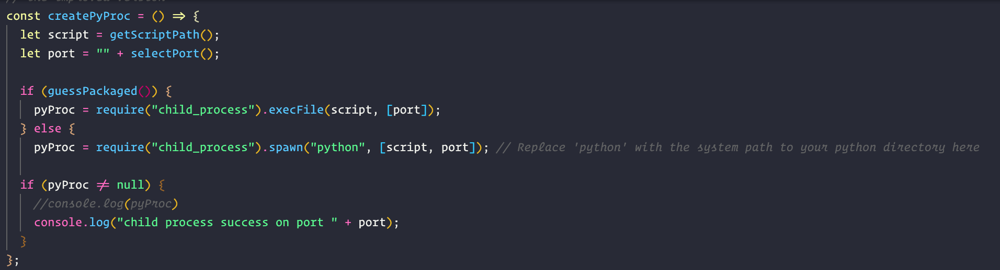

<!--
*** Thanks for checking out the Best-README-Template. If you have a suggestion
*** that would make this better, please fork the repo and create a pull request
*** or simply open an issue with the tag "enhancement".
*** Thanks again! Now go create something AMAZING! :D
***
***
***
*** To avoid retyping too much info. Do a search and replace for the following:
*** github_username, repo_name, twitter_handle, email, project_title, project_description
-->


<!-- PROJECT LOGO -->
<br />
<p align="center">
  <a href="https://github.com/github_username/repo_name">
    
  </a>

  <h3 align="center">Electron Python Calculator</h3>

  <p align="center">
    A simple client-server desktop calculator built with Electron and Python. 
  </p>
</p>


<!-- TABLE OF CONTENTS -->
<details open="open">
  <summary><h2 style="display: inline-block">Table of Contents</h2></summary>
  <ol>
    <li>
      <a href="#about-the-project">About The Project</a>
      <ul>
        <li><a href="#built-with">Built With</a></li>
      </ul>
    </li>
    <li>
      <a href="#getting-started">Getting Started</a>
      <ul>
        <li><a href="#prerequisites">Prerequisites</a></li>
        <li><a href="#installation">Installation</a></li>
      </ul>
    </li>
    <li><a href="#usage">Usage</a></li>
    <li><a href="#acknowledgements">Acknowledgements</a></li>
  </ol>
</details>


<!-- ABOUT THE PROJECT -->
## About The Project
This calculator allows you to perform simple addition and subtraction. It uses Electron as a GUI and communicates via RPCs using zerorpc to a Python server that performs the arithmetic operations. It is heavily informed by Github user fyears's project electron-python-example. It installation, testing, and running works on MacOS, but has not yet been tested on Windows or Linux.


### Built With

* []() Electron - Javascript, HTML5, CSS3
* []() Python 
* []() Zerorpc


<!-- GETTING STARTED -->
## Getting Started

There are two ways to get started. If you want to run the application executable yourself (only for Darwin ) then download the ZIP file and run the 
executable found within the "pretty-calculator-darwin-x64" folder.
If you want to review and test the application yourself you need to ensure you perform the steps outlined in the prerequisites section. Then move on to the installation section and complete the steps there.
 

### Prerequisites

Download Node.js version 6.0.0 - it is recommended to use a version manager such as NVM to avoid having to replace your system's current version of 
Node.js. 
1. Install Node.js version 6.0.0 by finding the 6.0.0 official release at nodejs.org here: <a href="https://nodejs.org/en/download/releases/">nodejs previous releases</a>. Alternatively, use NVM to install Nodejs 6.0.0 by following this guide at NVM's Github repo: <a href="https://github.com/nvm-sh/nvm">NVM Guide</a>
2. Install Python. Python 3 is recommended as Python 2 has been sunsetted since January 1, 2020. You can download python 3 here: <a href="https://www.python.org/downloads/">Python 3 Downloads </a>. It is also recommended to add Python 3 to your system's path. If you decide to use Python 2 there is no guarantee the app will run correctly.
3. For using zerorpc, you will also need the C/C++ compilers if they are not already installed on your system (cc and c++ in the command line, and/or MSVC on Windows).
 

### Installation - Electron Part

1. Clone the repo
   ```sh
   git clone https://github.com/aaronm-2112/zerorpcs-exercise
   ```
2. Install NPM packages while being sure to build the correct version of electron.
   ```sh
   npm install --runtime=electron --target=1.7.6
   ```
   
   
### Installation - Python Part
1. Use pip to install the necessary package:
   ```sh
   pip zerorpc
   ```


<!-- USAGE EXAMPLES -->
## Usage

### Starting the app
To start the app simply run:
  ```sh
   npm start
  ```
  
This will run the electron application using the bundled Python server found in the pycalcdist folder. If you want the Electron application to connect to the python server that hasn't been bundled (which is in the pycalc folder ) simply delete the pycalcdist folder.

After running npm start, simply follow the on screen instructions to begin using the calculator. 

## Known errors and fixes
Note: You may need to wait for the Python server to start before getting any sum results on start up. If you never receive any results when clicking the sum button, and you have deleted the pycalcdist folder, you may need to navigate to main.js and change the python command found in createPyProc to the path of your python installation - in particular, the one that is connected to the version of pip you used to install zerorpc.




If the above does not give you a response back from the Python server, then it may be an issue with your installation of Zeromq and Electron. To fix this, try the below steps:

```sh
  # uninstall your node_modules with
  rm -rf node_modules 
  
  # clear relevant caches
  rm -rf ~/.node-gyp
  rm -rf ~/.electron-gyp
  
  # set the npm config environment variables
  export npm_config_target=1.7.6 # electron version
  export npm_config_runtime=electron
  export npm_config_disturl=https://atom.io/download/electron
  export npm_config_build_from_source=true

  # may not be necessary
  #export npm_config_arch=x64
  #export npm_config_target_arch=x64

  # run npm config ls to see if the aboce environment variables have been set for your current terminal session
  npm config ls
  
  # then install everything again -- without the set target command used above
  npm install 
  
  # at this point you should no longer have any issues with the application. Remember to wait on first startup for the Python server to connect
  npm start
  
  
```


### Testing the app
To test the application simply run the following command in the project directory: 
  ```sh
   npm test
  ```

<!-- ACKNOWLEDGEMENTS -->
## Acknowledgements

* []() Github user othneildrew for the readme template: https://github.com/othneildrew/Best-README-Template
* []() Github user fyears for the project architecture, skeleton, and packaging:  https://github.com/fyears/electron-python-example


<!-- MARKDOWN LINKS & IMAGES -->
<!-- https://www.markdownguide.org/basic-syntax/#reference-style-links -->
[contributors-shield]: https://img.shields.io/github/contributors/github_username/repo.svg?style=for-the-badge
[contributors-url]: https://github.com/github_username/repo_name/graphs/contributors
[forks-shield]: https://img.shields.io/github/forks/github_username/repo.svg?style=for-the-badge
[forks-url]: https://github.com/github_username/repo_name/network/members
[stars-shield]: https://img.shields.io/github/stars/github_username/repo.svg?style=for-the-badge
[stars-url]: https://github.com/github_username/repo_name/stargazers
[issues-shield]: https://img.shields.io/github/issues/github_username/repo.svg?style=for-the-badge
[issues-url]: https://github.com/github_username/repo_name/issues
[license-shield]: https://img.shields.io/github/license/github_username/repo.svg?style=for-the-badge
[license-url]: https://github.com/github_username/repo_name/blob/master/LICENSE.txt
[linkedin-shield]: https://img.shields.io/badge/-LinkedIn-black.svg?style=for-the-badge&logo=linkedin&colorB=555
[linkedin-url]: https://linkedin.com/in/github_username
